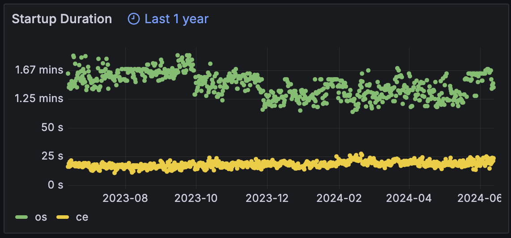

## Statistics

* Usually not important, but can be a useful tool <!-- .element: class="fragment" -->
  - Grafana is really the way to go <!-- .element: class="fragment" -->
* https://stats.compiler-explorer.com/ <!-- .element: class="fragment" -->
* Add custom metrics <!-- .element: class="fragment" -->
  - https://github.com/partouf/prometheus-client-delphi <!-- .element: class="fragment" -->

---

## Statistics

