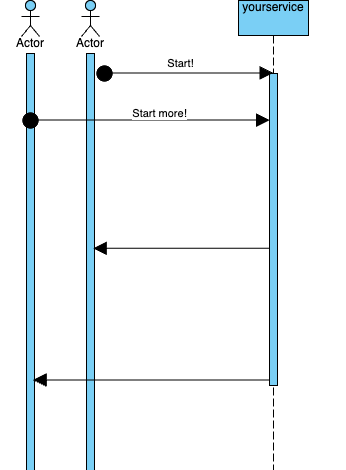
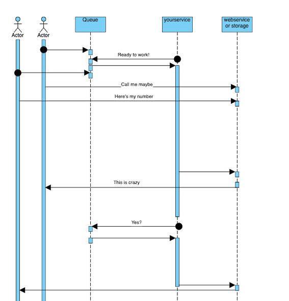

## Think about it

* If long running tasks, go for Queue early, it's more complicated to add later <!-- .element: class="fragment" -->
  - Azure Storage - Queue / AWS SQS <!-- .element: class="fragment" -->
  - [Data.Cloud.AzureAPI](https://docwiki.embarcadero.com/Libraries/Athens//en/Data.Cloud.AzureAPI.TAzureQueueService)<!-- .element: class="fragment" -->
  - [Data.Cloud.AmazonAPI](https://docwiki.embarcadero.com/Libraries/Athens/en/Data.Cloud.AmazonAPI.TAmazonQueueService)<!-- .element: class="fragment" -->
  - Appercept <!-- .element: class="fragment" -->
  - STOMP <!-- .element: class="fragment" -->

Note:
* Way better for load-balancing

---

#### Http driven busy-work

---

#### Queue driven complexity

